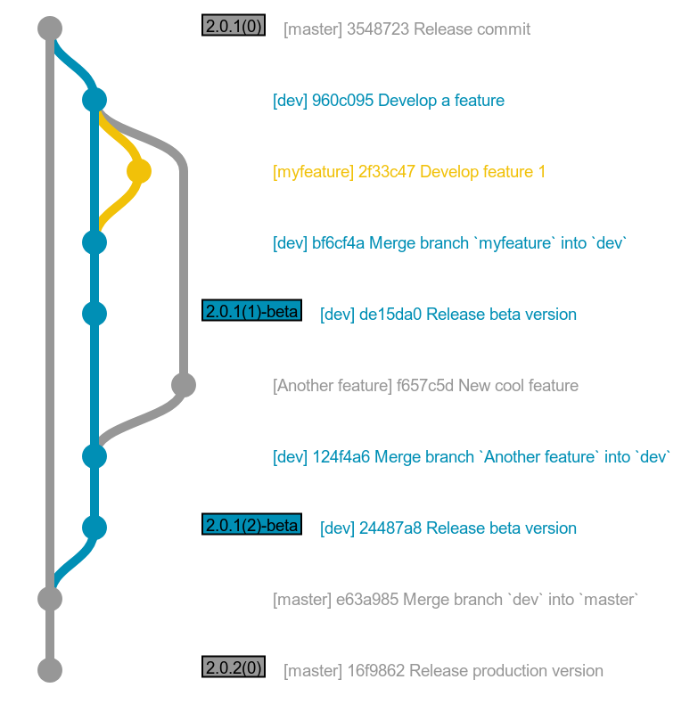

# Development workflow

This page describes the workflow we use for development. If you're a first time contributor, the first section should be enough for you. You can safely skip the following sections which are aimed at our core team.

# Workflow if you're a first time contributor

Typically, you would open an issue to first discuss what changes you want to make. Or you could just pick an issue that is already [in the list](https://github.com/mapswipe/mapswipe/issues).

If you don't know what to pick, we recommend you look for issues labelled [help wanted](https://github.com/mapswipe/mapswipe/issues?q=is%3Aissue+is%3Aopen+label%3A%22help+wanted%22). These have been marked by the core developers as easier to work on, and probably good for a first contribution.

As usual with github repositories, fork the repo, setup your developer environment as described in the following links for [android](develop-android) or [iOS](develop-ios). Then hack away!

When you're done, please [submit a PR](https://github.com/mapswipe/mapswipe/compare). Make sure to do it against the `dev` branch.

We will get notified, and review your changes. We might ask you to modify certain bits of your code before everything gets merged, to make sure that the code base remains fairly consistent and clean.

If you need help with anything in the code, you can reach out via the github issues, or get in touch via email as explained [here](https://mapswipe.org/get-involved.html).

# Workflow overview (for the core team)

All development happens on the `dev` branch. The `master` branch should only be updated by merging changes in the `dev` branch (plus a tagged release commit, see below).

For each change, we typically will open a `feature branch` off of the `dev` branch. Work will happen in that feature branch, which then gets merged into `dev` (via a PR), so that a dev release that includes the changes can be tested internally.

When we're happy with the state of the `dev` branch, we open a PR onto `master` and merge it. We then need to do a `tagged release commit` (using the `bash scripts/version.sh` script) in `master` to trigger the release to the app/playstore.

## Version numbering

We talk a lot about build numbers below. This is all Apple's fault, as they're release review process is slow (up to 24h), but if you submit two builds with the same `version number` but a different `build number`, the review is instant. This is cool for testing, and the workflow below tries to take advantage of that.

We use 2 sets of numbers, one for the `dev` app, one for the `production` app. To limit confusion:
- all numbers use [semantic versioning](https://semver.org/), plus a build number in brackets `(x)` appended at the end. Something like `2.1.3(4)`.
- the testing app (variously called `dev` or `beta`) has a `-beta` added at the end of its version name, so `2.1.3(4)-beta`
- `production` releases always use build number `0` to limit user confusion.
- after a `production` release, say `2.1.3(0)`, we immediately upload a corresponding `beta` to testflight with the next build number (so `2.1.3(1)-beta`). This one will take about 24 hours to review by Apple, but it will allow much faster test releases afterwards.
- From there, while `2.1.3(0)` is the latest version in the stores, we release `2.1.3(N)-beta` with `N > 1` for testing, until we're ready to release to production, at which point the version will become `2.1.4(0)`, and we restart the cycle.

This numbering logic should make it clear which version is the latest, both in `dev` and `production`, and also make it easy to see the link between the two apps at any time.

Below is an example of workflow in git (simplified for the docs):

Source for the graph: http://jsfiddle.net/w5ugatmq/2/
